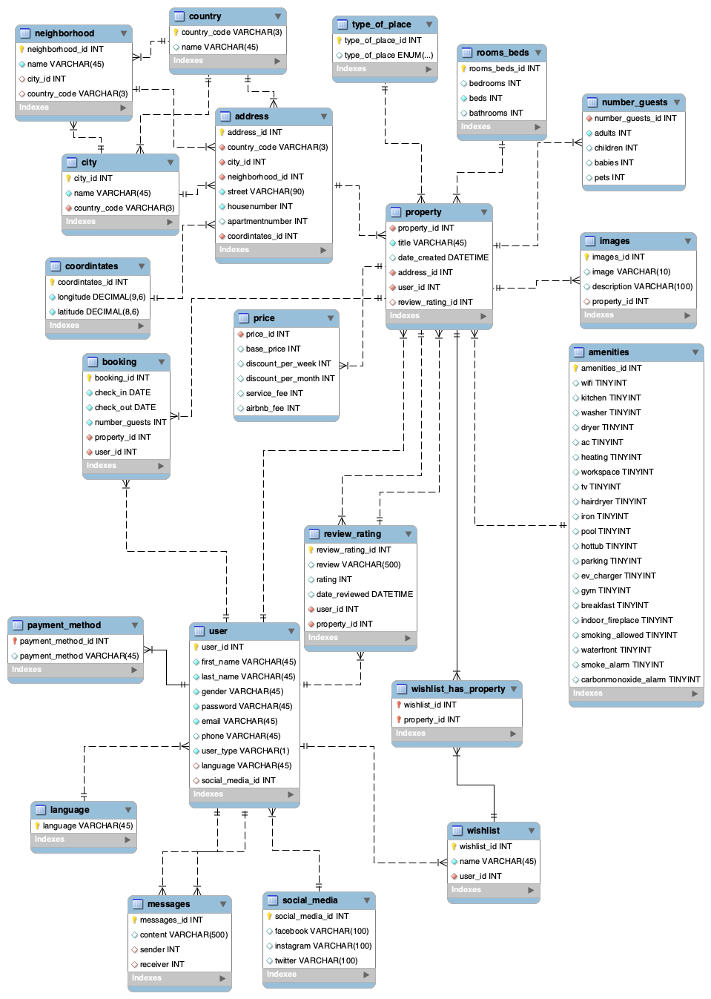

# Conception Phase

The overall goal of this project is to design an SQL database for the Airbnb task.

## General idea

In this phase, the objective lies in creating an Entity-Relationship-Model (ERM), which will be the basis of the database structure. The database modeling process is crucial to guarantee a well-functioning database. A methodology and a deep dive into different entities, attributes, and relationships are necessary.

## What is Airbnb?

Airbnb is the world's most popular marketplace for lodging, homestays, vacation rentals, and tourism activities. Tourists looking for a trip anywhere in the world can book via the platform. There are three roles on the platform: guests, hosts, and Airbnb itself.

## What roles are on Airbnb?

The platform needs guests who seek and pay for the rentals. Airbnb needs hosts who create the content and list their apartments. And then there is Airbnb itself which acts as middleman connecting hosts willing to rent their apartments to guests.

## What actions do the roles perform?

### Guest

- Create an account filled with personal information like email, phone, password, social media
- Choose search specifications like dates, locations, and number of guests
- Airbnb displays a list of properties available based on search metrics
- Users can either pass on, save in a wishlist or open the property in a separate window
  - A wishlist can be created with multiple properties
  - The wishlist shows the properties and their availability, independent of location, meaning that numerous sites can be saved on a wishlist
- Once decided, the user will book a place and pay with their preferred transaction method.

## Host

A host is a regular user who displays properties to rent—all functionality of a user plus property management.

- The host chooses, e.g., title, location, and amenities for the property

- Then the host adds images, type of place, and min & max guest counts

- The host proceeds to add service fees, discounts, and price

### Airbnb

Being the middleman means that Airbnb handles the display of properties, the array of reviews for properties and both users, and transactions.

### Properties

The other important entity is the properties themselves. On the main page of Airbnb, the users search for accommodation at a particular location and check whether their favorite places are available during their date range. The basic information about the properties must include areas, availability, number of people, pictures, descriptions, and pricing. The guest filters from all properties and displays the ones that match the guest's filter.

## Limitations

A possible issue could be observed in how hosts and guests are not separated enough. It could be beneficial to separate guests and hosts at two different tables for better differentiation. As reviews, ratings, pictures are separated by host and guest as well.

## ERD

## Summary

To create the EDR, I have used my personal Airbnb account to document each step from search to booking. I made sure to enter all displayed details like amenities, filters, prices, fees, etc.

The problem was separating the values and ensuring Normal forms so that data redundancy is taken care of and data integrity is in place. For example, for the address data, I decided to split up each component (country, state, city, and neighborhood) to assure data integrity. Furthermore, after using the platform, I realized that the map is very dominant and essential. I have decided to add the geographical location via longitude and latitude to the address.

Another issue was seen in the differentiation of hosts and guests. After using the platform, I have concluded that all hosts also have guest functionality. This means that hosts can book other hosts' properties as a guest. This feature made me combine hosts and guests in one table and separate them with a BOOLEAN attribute called _is_host._
